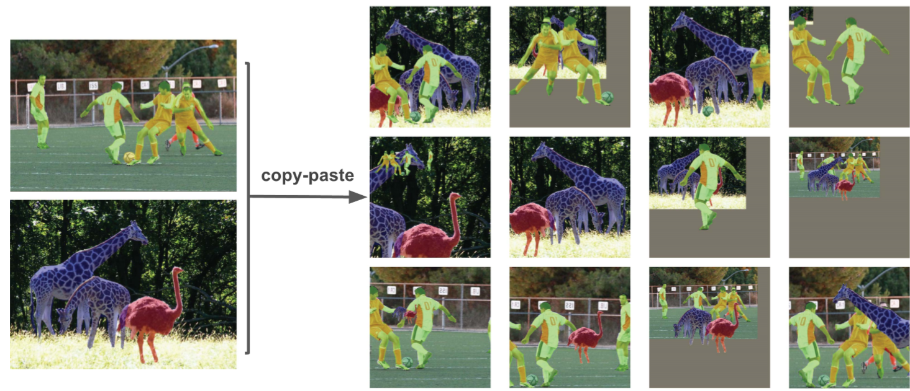
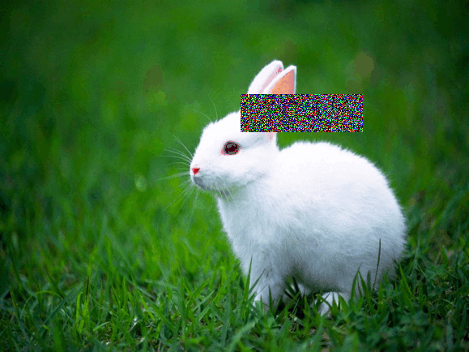
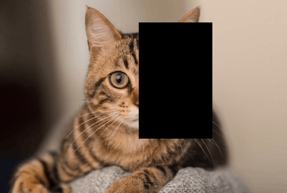
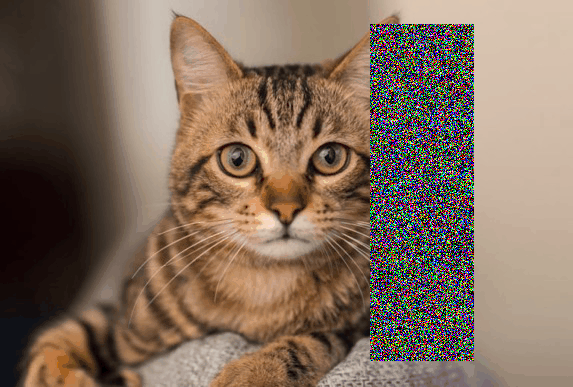
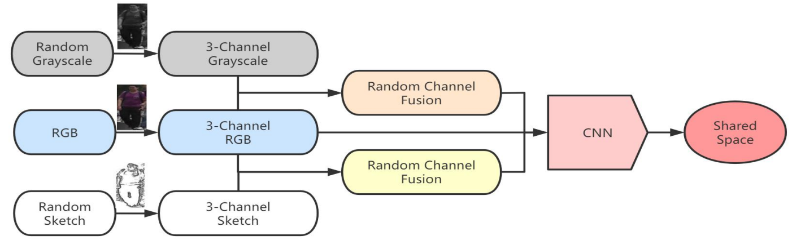

This library helps you with augmenting images for your machine learning projects. It converts a set of input images into a new, much larger set of slightly altered images. Many very popular projects have been integrated. New methods like augmix,cutmix，are being tracked. Whether you're a researcher or an engineer, just enjoy it!

# Popular Projects

## imgaug

- intro: 2019
- github star: 7.8k
- github: <https://github.com/aleju/imgaug>

## Albumentations
**Albumentations: fast and flexible image augmentations**

- intro: ArXiv 2018
- github star: 4.1k
- arxiv: <https://arxiv.org/abs/1809.06839v1>
- github: <https://github.com/albumentations-team/albumentations>

## Augmentor
**Biomedical image augmentation using Augmentor**

- intro: Bioinformatics
- github star: 3.7k
- arxiv: <https://github.com/mdbloice/Augmentor>
- github: <https://github.com/mdbloice/Augmentor>
- docs: <https://augmentor.readthedocs.io/en/master/>

Augmentor is a Python package designed to aid the augmentation and artificial generation of image data for machine learning tasks. It is primarily a data augmentation tool, but will also incorporate basic image pre-processing functionality.

# Papers&Codes

## mixup

**Mixup: BEYOND EMPIRICAL RISK MINIMIZATION**

- intro: ICLR2018
- arxiv: <https://arxiv.org/abs/1710.09412>
- github: <https://github.com/facebookresearch/mixup-cifar10>

Mixup is a generic and straightforward data augmentation principle. In essence, mixup trains a neural network on convex combinations of pairs of examples and their labels. By doing so, mixup regularizes the neural network to favor simple linear behavior in-between training examples.

## Cutout
**Improved Regularization of Convolutional Neural Networks with Cutout**

- intro: arXiv 2017
- arxiv: <https://arxiv.org/abs/1708.04552>
- github: <https://github.com/uoguelph-mlrg/Cutout>

## Cutmix
**CutMix:Regularization Strategy to Train Strong Classifiers with Localizable Features**

- intro: ICCV 2019 (oral talk)
- arxiv: <https://arxiv.org/pdf/1905.04899.pdf>
- github: <https://github.com/clovaai/CutMix-PyTorch>

## Augmix
**AUGMIX: A SIMPLE DATA PROCESSING METHOD TO IMPROVE ROBUSTNESS AND UNCERTAINTY**

- intro: ICLR 2020
- arxiv: <https://arxiv.org/pdf/1912.02781.pdf>
- github: <https://github.com/google-research/augmix>

## copy-paste
**Simple Copy-Paste is a Strong Data Augmentation Method for Instance Segmentation**

- intro: 2020
- provider: google
- arxiv: <https://arxiv.org/pdf/2012.07177.pdf>
- github: <https://github.com/google-research/augmix>
- 

## fast-autoaugment
**Fast AutoAugment**

- intro: NeurIPS 2019 
- github star: 671
- arxiv: <https://arxiv.org/abs/1905.00397>
- github: <https://github.com/kakaobrain/fast-autoaugment>

## AutoAugment
**AutoAugment:Learning Augmentation Strategies from Data**

- intro: CVPR 2019
- provider: google
- arxiv: <https://arxiv.org/pdf/1805.09501v3.pdf>
- github: <https://github.com/DeepVoltaire/AutoAugment>

## RandAugment
**RandAugment: Practical automated data augmentation with a reduced search space**

- intro: ICLR 2020
- provider: google
- arxiv: <https://arxiv.org/pdf/1909.13719.pdf>
- github: <https://github.com/tensorflow/tpu/tree/master/models/official/efficientnet>

## Random-Erasing
**Random Erasing Data Augmentation**

| black  | white | random |
|----------------------------------------------------------------------------------------------------------------------------|--------------------------------------------------------------------------------------------------------------------------------------------------------|--------------------------------------------------------------------------------------------------------------------------------------------------------|
||| |
||| |

- intro:  AAAI 2020
- arxiv: <https://arxiv.org/pdf/1708.04896.pdf>
- github: <https://github.com/zhunzhong07/Random-Erasing>

## GridMask
**GridMaskDataAugmentation**

- intro:  2020.01
- arxiv: <https://arxiv.org/abs/2001.04086>
- github: <https://github.com/akuxcw/GridMask>
- 知乎参考: <https://zhuanlan.zhihu.com/p/103992528>

## MMD
**A Person Re-identification Data Augmentation Method with Adversarial Defense Effect**

- intro:  2021.01
- arxiv: <https://arxiv.org/abs/2001.04086>
- github: <https://github.com/finger-monkey/ReID_Adversarial_Defense>

## imagecorruptions
**Benchmarking Robustness in Object Detection:Autonomous Driving when Winter is Coming**

- intro: arXiv  2019
- arxiv: <https://arxiv.org/abs/1807.01697>
- github: <https://github.com/CrazyVertigo/imagecorruptions>

## CycleGAN
**Unpaired Image-to-Image Translation using Cycle-Consistent Adversarial Networkss**

- intro: ICCV 2017
- arxiv: <https://arxiv.org/pdf/1912.02781.pdf>
- provider: UC Berkeley
- github: <https://github.com/junyanz/pytorch-CycleGAN-and-pix2pix>
- github: <https://github.com/junyanz/CycleGAN>

## ALAE
**Adversarial Latent Autoencoders**

- intro: CVPR 2020
- arxiv: <https://arxiv.org/pdf/2004.04467.pdf>
- github: <https://github.com/podgorskiy/ALAE>

## Small Object Augmentation
**Unpaired Image-to-Image Translation using Cycle-Consistent Adversarial Networkss**

- intro:  2017
- arxiv: <https://arxiv.org/pdf/1902.07296.pdf>
- github: <https://github.com/gmayday1997/SmallObjectAugmentation>

## Segmentation & Matting
**Real-Time High-Resolution Background Matting**

- intro:  2020.12
- arxiv: <https://arxiv.org/abs/2012.07810>
- github: <https://github.com/PeterL1n/BackgroundMattingV2>

## Image Composition:Deep Image Harmonization
**Deep Image Harmonization via Domain Verification**

- intro: CVPR 2020 
- provider: SJTU
- arxiv: <https://arxiv.org/abs/1911.13239>
- github: <https://github.com/bcmi/Image_Harmonization_Datasets>

**InstaBoost: Boosting Instance Segmentation Via Probability Map Guided Copy-Pasting**

- intro: ICCV 2019  
- provider: SJTU
- arxiv: <https://arxiv.org/abs/1908.07801>
- github: <https://github.com/GothicAi/Instaboost>

# Hard data mining
**Unsupervised Hard Example Mining from Videos for Improved Object Detection**

- intro: ECCV 2018  
- arxiv: <http://vis-www.cs.umass.edu/unsupVideo/docs/unsup-video_eccv2018.pdf>
- github: <https://github.com/adiprasad/unsup-hard-negative-mining-mscoco>
- project: <http://vis-www.cs.umass.edu/unsupVideo/>
- demo video: <http://vis-www.cs.umass.edu/unsupVideo/docs/suppVideo.mp4>
- 知乎参考: <https://zhuanlan.zhihu.com/p/174057800>

# Annotation Tools

## labelImg

- intro: 2017
- github star: 9.8k
- github: <https://github.com/tzutalin/labelImg>

LabelImg is a graphical image annotation tool and label object bounding boxes in images.

## labelme

- intro: 2017
- github star: 4.2k
- github: <https://github.com/wkentaro/labelme>

Image Polygonal Annotation with Python (polygon, rectangle, circle, line, point and image-level flag annotation).

# Continuous updating...

If you find this library useful for your research, please consider starring the GitHub repository.